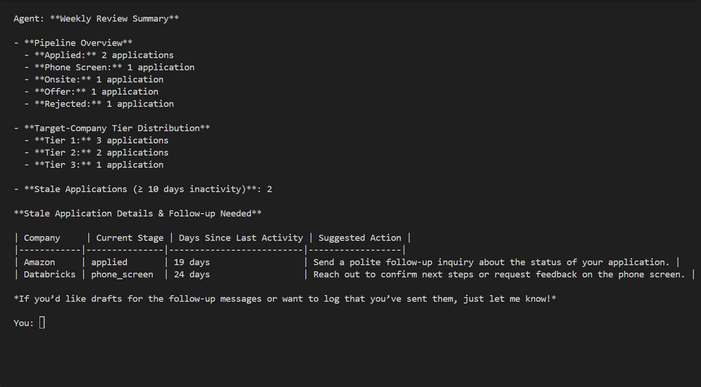
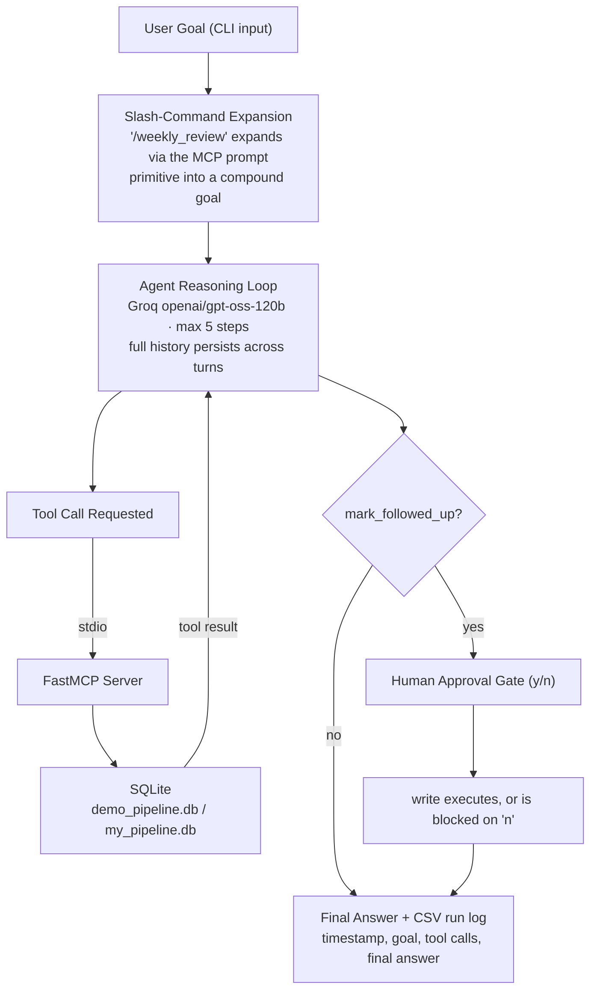

# PipelinePilot — Agent + MCP Server for Job-Search Pipeline Tracking

Ask a CLI agent for your job-search pipeline health in plain English — stale-application alerts, weekly reviews, and follow-up drafting with a real human approval gate — backed by a hand-built agent loop and a custom MCP server, not a prebuilt agent framework.

---

## Demo



*No hosted deployment (see [Known Limitations](#known-limitations)) — this is a CLI tool, run locally against your own pipeline data.*

---

## Why PipelinePilot is Different

- **Full MCP primitive coverage, not just tools** — a resource (`target-companies://{tier}`) and a prompt (`/weekly_review`) sit alongside all 7 tools, loaded and expanded by the host directly.
- **The approval gate actually blocks writes.** `mark_followed_up` requires explicit `y`/`n` confirmation before touching the database — verified end-to-end on both the approve and decline paths, not just present in name.
- **Disambiguates real-world duplicate applications.** Reapplying to the same company for a different role is normal during a real job search — `get_application` returns every match instead of silently picking one.
- **No agent framework.** The reasoning loop, tool-schema translation, conversation memory, and approval gate are hand-built in `agent.py` — no LangChain, no agent SDK.

---

## Architecture



---

## Tech Stack

| Layer | Tool |
|---|---|
| Agent runtime | Hand-built reasoning loop (no framework), Python `asyncio` |
| LLM | Groq API (`openai/gpt-oss-120b`) |
| Tool protocol | Model Context Protocol (MCP) via FastMCP |
| Database | SQLite, `CHECK` constraints on `tier` / `current_stage` |
| Config | python-dotenv (`.env` for API key + DB path) |
| Logging | Per-run CSV logging (timestamp, goal, tool calls, final answer) |

---

## Setup

**1. Clone and install dependencies**

```bash
git clone https://github.com/mohitkrishna21/PipelinePilot.git
cd PipelinePilot
pip install -r requirements.txt
```

**2. Add your Groq API key and database path**

Create a `.env` file in the project root:

```
GROQ_API_KEY=your_key_here
DB_PATH=db/demo_pipeline.db
```

Get a free key at [console.groq.com](https://console.groq.com).

---

## Running the Agent

**1. Build the demo database**

```bash
python db/seed_db.py
```

Safe to re-run any time — wipes and rebuilds the same fabricated dataset, never duplicates rows.

**2. Run the agent**

```bash
python agent/agent.py
```

Try, in order: `give me a pipeline summary`, `/weekly_review`, then `draft a follow-up for <company>` to exercise the approval gate. Type `quit` or `exit` to end the session.

---

## MCP Primitives Reference

| Name | Type | What it does |
|---|---|---|
| `list_applications(stage, tier)` | Tool — read | All applications, optionally filtered by stage and/or tier |
| `get_application(company)` | Tool — read | Substring lookup by company. Full detail for one match, a disambiguated list for multiple matches, a fuzzy "did you mean 'Databricks'?" suggestion for none |
| `get_stale_applications(threshold_days=10)` | Tool — read | Applications inactive for `threshold_days`+, excluding terminal stages (offer / rejected / withdrawn) |
| `get_pipeline_summary()` | Tool — read | Counts by stage and tier, plus total stale count |
| `log_application(...)` | Tool — write, ungated | Records a new application |
| `update_application(...)` | Tool — write, ungated | Updates fields on an existing application |
| `mark_followed_up(company, draft_text)` | Tool — write, **gated** | Records a follow-up as sent; requires explicit y/n approval first |
| `target-companies://{tier}` | Resource | Serves `data/target_companies.json` — real Tier1/Tier2/Tier3/stretch target list |
| `/weekly_review` | Prompt | Expands into one compound goal: summary + stale list with days-elapsed + prioritized suggestions |

---

## Key Design Decisions

**Demo vs. real data split** — the server never hardcodes a database filename, reading `DB_PATH` from `.env` instead. `db/demo_pipeline.db` (fabricated, realistic) is committed so `git clone` + run works immediately; `my_pipeline.db` is gitignored and never leaves my machine.

**Only `mark_followed_up` is gated** — `log_application`/`update_application` are plain data entry with no external consequence. Marking a follow-up as sent represents an actual outreach decision, so it's the one write that stops for approval.

**`get_application` returns every match, not the first one** — a single-row assumption breaks the moment you reapply to a company for a different role, which is normal during a real search, not an edge case.

**CHECK constraints at the database layer** — `tier` and `current_stage` are validated by SQLite itself, not just at the tool layer, as a second line of defense against bad writes.

**Full conversation history persists per session** — the message list lives outside the per-turn loop, so follow-up references like "that draft" resolve correctly instead of the agent starting from a blank slate every message.

**Token-usage warning over silent truncation** — Groq's per-minute token cap for this model is easy to approach in a long single session. `get_llm_response` checks the exact `prompt_tokens` count Groq returns and warns past a threshold, rather than silently dropping history or failing without notice.

**Groq `openai/gpt-oss-120b`** — same model migration as HybridRAG, after `llama-3.3-70b-versatile` was decommissioned August 2026.

---

## Known Limitations

**No automatic context trimming** — the token-usage warning notifies but doesn't truncate; an unusually long single session could still eventually hit Groq's TPM limit outright.

**No stage-history table** — can't yet analyze how long an application spent in each stage. Deliberately skipped as premature complexity with only a handful of real applications at launch.

**CLI only, no web UI** — a deliberate scope choice for a personal daily-use tool, not a limitation of the underlying design.

**No hosted deployment** — built and used as a local CLI tool for personal daily use, not a public-facing service.

**Real-data schema setup is manual for now** — `seed_db.py` currently only builds the demo file; switching to `my_pipeline.db` needs its schema created separately before first real use.

---

## Future Work

- FastAPI + HTML frontend as a polish layer
- Stage-history table for duration analytics once real data accumulates
- Automatic message-history trimming/summarization for long sessions
- `tests/test_tools.py` — direct tests of tool functions

---

## License

[MIT](LICENSE)
