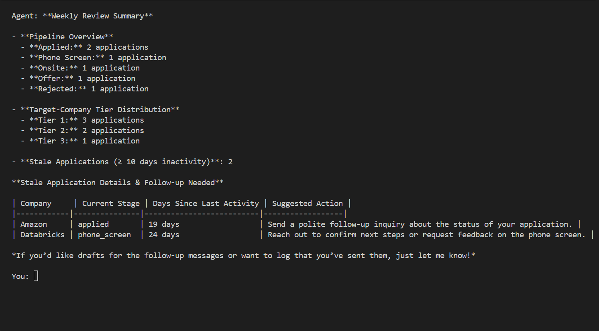
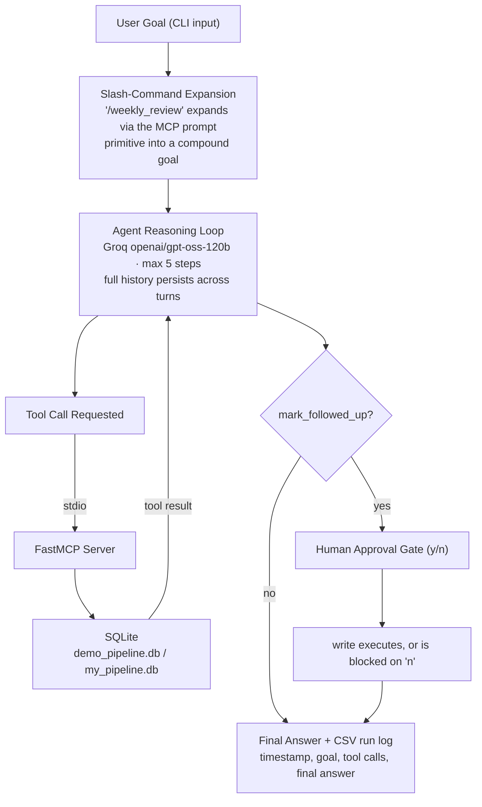

# PipelinePilot — Agent + MCP Server for Job-Search Pipeline Tracking

Ask a CLI agent for your job-search pipeline health in plain English — stale-application alerts, weekly reviews, and follow-up drafting with a real human approval gate — backed by a hand-built agent loop and a custom MCP server, not a prebuilt agent framework.

Then rebuilt a second time on the OpenAI Agents SDK, side by side with the hand-built version, and extended with **Pitch Note** — grounded application-note drafting with a guardrail that refuses to overstate my experience. See [v2](#v2--rebuilt-on-the-openai-agents-sdk).

---

## Demo



*No hosted deployment (see [Known Limitations](#known-limitations)) — this is a CLI tool, run locally against your own pipeline data.*

---

## Why PipelinePilot is Different

- **Full MCP primitive coverage, not just tools** — a resource (`target-companies://{tier}`) and a prompt (`/weekly_review`) sit alongside all 7 tools, loaded and expanded by the host directly.
- **The approval gate actually blocks writes.** `mark_followed_up` requires explicit `y`/`n` confirmation before touching the database — verified end-to-end on both the approve and decline paths, not just present in name.
- **Disambiguates real-world duplicate applications.** Reapplying to the same company for a different role is normal during a real job search — `get_application` returns every match instead of silently picking one.
- **Built twice, by hand and on a framework.** v1's reasoning loop, tool-schema translation, conversation memory, and approval gate are hand-built in `agent.py` — no LangChain, no SDK. v2 rebuilds the same agent on the OpenAI Agents SDK (`agent_sdk/`), so the repo is a direct, honest comparison of what a framework replaces and what it adds.

---

## Architecture


```mermaid
flowchart TD
    A["User Goal (CLI input)"] --> B["Slash-Command Expansion<br/>'/weekly_review' expands via the MCP prompt<br/>primitive into a compound goal"]
    B --> C["Agent Reasoning Loop<br/>Groq openai/gpt-oss-120b · max 5 steps<br/>full history persists across turns"]
    C --> D["Tool Call Requested"]
    D -- stdio --> E["FastMCP Server"]
    E --> F["SQLite<br/>demo_pipeline.db / my_pipeline.db"]
    F -- tool result --> C
    C --> G{"mark_followed_up?"}
    G -- yes --> H["Human Approval Gate (y/n)"]
    H --> I["write executes, or is blocked on 'n'"]
    G -- no --> J["Final Answer + CSV run log<br/>timestamp, goal, tool calls, final answer"]
    I --> J
```

*This is the v1 (hand-built) flow. v2 keeps the same MCP server and database and swaps the reasoning loop and approval gate for the SDK — see below.*

---

## Tech Stack

| Layer | Tool |
|---|---|
| Agent runtime | Hand-built reasoning loop (no framework), Python `asyncio` |
| LLM | Groq API (`openai/gpt-oss-120b`) |
| Tool protocol | Model Context Protocol (MCP) via FastMCP |
| Database | SQLite, `CHECK` constraints on `tier` / `current_stage` |
| Config | python-dotenv (`.env` for API key + DB path) |
| Logging | Per-run CSV logging (timestamp, goal, tool calls, final answer) |

---

## Setup

**1. Clone and install dependencies**

```bash
git clone https://github.com/mohitkrishna21/PipelinePilot.git
cd PipelinePilot
pip install -r requirements.txt
```

**2. Add your Groq API key and database path**

Create a `.env` file in the project root:

GROQ_API_KEY=your_key_here
DB_PATH=db/demo_pipeline.db


Get a free key at [console.groq.com](https://console.groq.com).

---

## Running the Agent

**1. Build the demo database**

```bash
python db/seed_db.py
```

Safe to re-run any time — wipes and rebuilds the same fabricated dataset, never duplicates rows.

**2. Run the agent**

```bash
python agent/agent.py
```

Try, in order: `give me a pipeline summary`, `/weekly_review`, then `draft a follow-up for <company>` to exercise the approval gate. Type `quit` or `exit` to end the session.

---

## MCP Primitives Reference

| Name | Type | What it does |
|---|---|---|
| `list_applications(stage, tier)` | Tool — read | All applications, optionally filtered by stage and/or tier |
| `get_application(company)` | Tool — read | Substring lookup by company. Full detail for one match, a disambiguated list for multiple matches, a fuzzy "did you mean 'Databricks'?" suggestion for none |
| `get_stale_applications(threshold_days=10)` | Tool — read | Applications inactive for `threshold_days`+, excluding terminal stages (offer / rejected / withdrawn) |
| `get_pipeline_summary()` | Tool — read | Counts by stage and tier, plus total stale count |
| `log_application(...)` | Tool — write, ungated | Records a new application |
| `update_application(...)` | Tool — write, ungated | Updates fields on an existing application |
| `mark_followed_up(company, draft_text)` | Tool — write, **gated** | Records that I followed up and saves the draft — it does not send anything; requires explicit y/n approval first |
| `target-companies://{tier}` | Resource | Serves `data/target_companies.json` — real Tier1/Tier2/Tier3/stretch target list |
| `/weekly_review` | Prompt | Expands into one compound goal: summary + stale list with days-elapsed + prioritized suggestions |

---

## Key Design Decisions

**Demo vs. real data split** — the server never hardcodes a database filename, reading `DB_PATH` from `.env` instead. `db/demo_pipeline.db` (fabricated, realistic) is committed so `git clone` + run works immediately; `my_pipeline.db` is gitignored and never leaves my machine.

**Only `mark_followed_up` is gated** — `log_application`/`update_application` are plain data entry with no external consequence. Marking a follow-up represents an actual outreach decision, so it's the one write that stops for approval.

**`get_application` returns every match, not the first one** — a single-row assumption breaks the moment you reapply to a company for a different role, which is normal during a real search, not an edge case.

**CHECK constraints at the database layer** — `tier` and `current_stage` are validated by SQLite itself, not just at the tool layer, as a second line of defense against bad writes.

**Full conversation history persists per session** — the message list lives outside the per-turn loop, so follow-up references like "that draft" resolve correctly instead of the agent starting from a blank slate every message.

**Token-usage warning over silent truncation** — Groq's per-minute token cap for this model is easy to approach in a long single session. `get_llm_response` checks the exact `prompt_tokens` count Groq returns and warns past a threshold, rather than silently dropping history or failing without notice.

**Groq `openai/gpt-oss-120b`** — same model migration as HybridRAG, after `llama-3.3-70b-versatile` was decommissioned August 2026.

---

## v2 — Rebuilt on the OpenAI Agents SDK

v1 is a hand-built agent: I wrote the tool-schema builder, the tool dispatcher, the reasoning loop, and the approval gate myself. v2 leaves that code untouched as a reference (`agent/`) and rebuilds the same agent on the OpenAI Agents SDK (`agent_sdk/`), running on OpenAI `gpt-4.1-mini`. The goal was to port a working agent, not follow a tutorial, so the comparison would be honest — and then to add a capability the hand-built version never had: **Pitch Note**.

### Hand-built vs SDK

| What it does | v1 (hand-built) | v2 (SDK) |
|---|---|---|
| Expose the MCP tools to the model | `build_tool_schemas` (~11 lines) | `MCPServerStdio(..., cache_tools_list=True)` |
| Run a tool the model picked | `execute_tool_call` (~9 lines) | handled by `Runner` |
| The reason–act–observe loop | `run_agent` loop (~20 lines) | one `Runner.run(...)` call |
| Approve before a write action | y/n interception in the loop (~11 lines) | `require_approval={"always": {"tool_names": ["mark_followed_up"]}}` |
| Remember the conversation | manual `messages` threading | `SQLiteSession` |
| Structured job-description output | — | `output_type=JDBreakdown` (Pydantic) |
| Block unsupported claims in a draft | — | output guardrail |

About 50 lines of hand-written plumbing collapsed into a handful of declarations. The real gain wasn't the line count, though — it was typed structured output and guardrails, which would have been genuine work to build by hand.

### Pitch Note

Paste a job description and PipelinePilot:

1. Runs a **JD Analyst** sub-agent that returns a typed breakdown — company, role, must-have and nice-to-have skills, red flags, and the exact work-authorization sentence from the posting, classified.
2. Pulls my resume facts.
3. Drafts a short note using only those facts, and lists any must-have skill the facts don't support as an explicit `Gaps:` line instead of papering over it.

The JD Analyst is attached to the main assistant as a tool (agent-as-tool), not a handoff, so the assistant stays in control and uses the typed result to keep going.

### The honesty guardrail

The interesting failure: a careful system prompt still let the model inflate a note — "strong LLM experience" when my facts showed none. A prompt asks the model to behave; it doesn't verify that it did. So every draft passes through an **output guardrail**, a separate cheap model call that checks each claim against my resume facts and blocks the note if anything isn't supported. Forward-looking lines ("eager to learn X") are fine; claims of experience I don't have are not.

The guardrail is a classifier, so I measure it. An 8-case eval (`evals/`) — 4 honest notes, 4 with invented claims — passes 8/8 with zero false positives and zero false negatives.

### Three things I learned

- **Tool-output wording steers the model more than the system prompt does.** A bug where the agent claimed a message was "sent" came from the tool's return string, not the prompt. Fixing the string fixed the behavior.
- **A rule works better as a template than as prose.** "Show the work-authorization line first" was ignored as an instruction and obeyed as a fixed output layout.
- **Latency is model round-trips, not tools.** In the traces, tool calls run in 7–26 ms; model calls take 1.4–2.8 s.

### Running v2

v2 uses its own virtual environment, kept separate from the server's because the SDK pins an older `mcp` version.

```bash
python -m venv .venv-sdk
.venv-sdk\Scripts\activate          # Windows
pip install -r requirements-sdk.txt

python -m agent_sdk.main            # run the agent (from the repo root)
python -m evals.run_guardrail_eval  # run the guardrail eval
```

Needs an OpenAI API key in `.env` (`OPENAI_API_KEY`), plus `SERVER_PYTHON` pointing at the server venv's Python so the SDK agent can launch the MCP server in its own environment.

---

## Known Limitations

**No automatic context trimming** — the token-usage warning notifies but doesn't truncate; an unusually long single session could still eventually hit Groq's TPM limit outright.

**No stage-history table** — can't yet analyze how long an application spent in each stage. Deliberately skipped as premature complexity with only a handful of real applications at launch.

**CLI only (for now)** — both versions run in the terminal. v2's agent sits behind a transport-agnostic `run_turn` function so a browser UI can wrap it without touching the agent, but that UI isn't wired up yet.

**No hosted deployment** — built and used as a local CLI tool for personal daily use, not a public-facing service.

**Real-data schema setup is manual for now** — `seed_db.py` currently only builds the demo file; switching to `my_pipeline.db` needs its schema created separately before first real use.

---

## Future Work

- A browser UI and a public demo you can try without cloning (FastAPI backend wrapping the v2 agent)
- A profile screen to enter your own background, so Pitch Notes are grounded in your facts rather than a file on disk
- A morning digest of new roles to apply to and applications to follow up, pulled from legitimate job feeds
- Stage-history table for duration analytics once real data accumulates
- `tests/test_tools.py` — direct tests of the tool functions

---

## License

[MIT](LICENSE)
